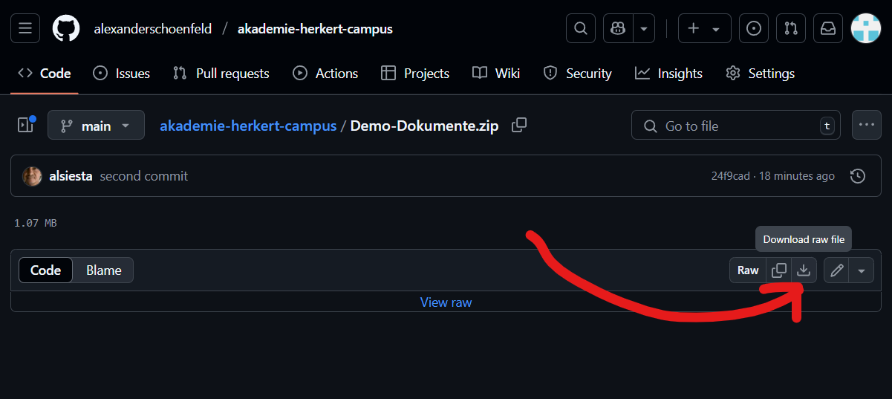
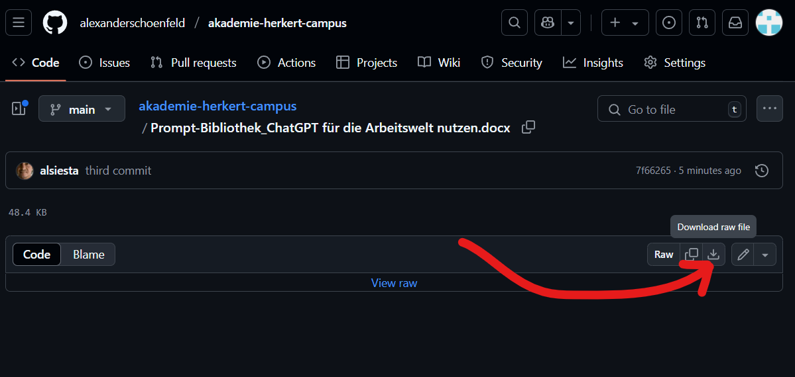

# Demo-Dokumente für ChatGPT Prompt-Bibliothek

Diese Repository enthält Beispieldokumente, die als Referenzmaterial für die "Prompt-Bibliothek: ChatGPT für die Arbeitswelt nutzen" dienen.

## Struktur

```
📁 Demo-Dokumente/
├── 📁 E-Mails/
│   ├── Corporate Wording.docx
│   ├── email_verlauf.docx
│   ├── freundliche_antwort.docx
│   └── inbox_eine_woche.docx
├── 📁 Finanzen + HR/
│   ├── Rückgabeanfrage_Kulanz_LisaBergmann.docx
│   └── Rückgaberichtlinie_BrightVision.docx
├── 📁 Kundenservice/
│   ├── Kundenanfrage_Rückgabe_Fernseher.docx
│   └── Rückgaberichtlinie_BrightVision.docx
├── 📁 Marketing/
│   └── Agentur-Briefing-Vorlage.docx
├── 📁 Marktforschung/
└── 📁 Produktentwicklung/
```

## Inhalt

Diese Repository enthält Beispieldokumente aus verschiedenen Geschäftsbereichen:

- **E-Mails**: Vorlagen und Beispiele für professionelle Kommunikation
- **Finanzen + HR**: Dokumente zu Rückgaben und Unternehmensrichtlinien
- **Kundenservice**: Beispiele für Kundenanfragen und Richtlinien
- **Marketing**: Vorlagen für Agentur-Briefings
- **Marktforschung**: Materialien zur Marktanalyse
- **Produktentwicklung**: Dokumente zur Produktentwicklung

## Verwendung

Die Dokumente in diesem Repository dienen als Beispiele für die Anwendung der Prompts aus der "Prompt-Bibliothek: ChatGPT für die Arbeitswelt nutzen". Sie können als Referenz verwendet werden, um die praktische Anwendung der Prompts besser zu verstehen.

## Downloads

- `Demo-Dokumente.zip` - Komprimierte Version aller Beispieldokumente
[DOWNLOAD DEMO DOKUMENTE](Demo-Dokumente.zip)
 

- `Prompt-Bibliothek_ChatGPT für die Arbeitswelt nutzen.docx` - Hauptdokument mit der Prompt-Bibliothek
[DOWNLOAD PROMPT BIBLIOTHEK](Prompt-Bibliothek_ChatGPT%20für%20die%20Arbeitswelt%20nutzen.docx)




## Hinweis

Alle enthaltenen Dokumente sind Beispiele und dienen ausschließlich Demonstrationszwecken.